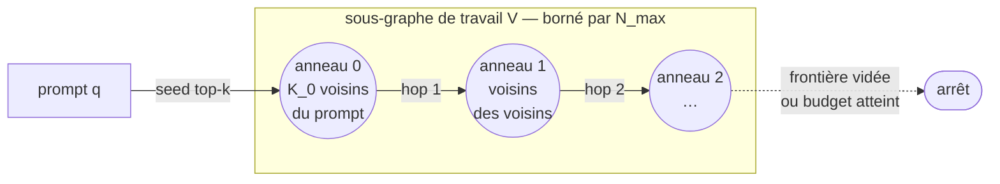

# 2.1 — Construction du graphe de similarité

> **Référence faisant foi.** Ce chapitre suit le mémo officiel Merlin Intelligence
> (`theory/260522_Eigenmind_Cognitive_Maps.pdf`, §3.1 et §4.1). Là où notre MVP avait pris
> une route différente, c'est **la définition du mémo qui prévaut**. Une note d'implémentation
> en fin de doc signale ce que `build_graph.py` fait encore autrement.

## Pourquoi un graphe au-dessus des embeddings ?

Avec uniquement des embeddings et Qdrant, on voit le corpus comme un **nuage de points** dans
un espace 384-d. On peut trouver les voisins d'un point, mais pas la **structure globale** :
quels groupes de chunks parlent du même sujet, lesquels font le pont entre groupes, lesquels
sont isolés.

Le graphe explicite cette structure : chaque chunk est un nœud, deux chunks sémantiquement
proches sont reliés, le poids de l'arête est leur similarité cosinus. Sur ce graphe on applique
toute la machinerie de la théorie des graphes : Laplacien, géodésiques, relaxations SDP.

## Deux régimes de similarité (le point que notre MVP avait raté)

Le mémo distingue **deux usages** de la similarité, qui ne sont pas redondants (§3.2.2) :

- **Retrieval top-k** (`store.similarity_search`, utilisé dans `pipelines/rag.py`) : un seul
  appel, `k` résultats, **pas de structure de graphe**. C'est le RAG dense classique. Il optimise
  la *pertinence au prompt*.
- **Exploration BFS** (`exploration.py`) : une **séquence** de lookups top-k où chaque requête
  est un *ID de point déjà stocké* plutôt qu'un nouvel embedding, accumulant un **sous-graphe de
  travail**. Il optimise la *couverture du voisinage du prompt*.

> Question d'analyste : *« Est-ce que je veux ce que le prompt demande, ou à quoi ressemble le
> monde autour du prompt ? »*

**Les trois stratégies de la phase 2 (Singular, Hinge, Theta) opèrent sur le second régime** :
elles analysent le sous-graphe BFS, pas la collection entière.

## Étape 0 — le sous-graphe par BFS sur l'index ANN (`exploration.py`)

Le « graphe » parcouru est l'**index approximate-nearest-neighbour (ANN) de Qdrant** : ses arêtes
relient chaque vecteur stocké à ses `k` plus proches voisins en espace d'embedding. Le BFS suit
ces liens ANN vers l'extérieur depuis le prompt.

1. **Seed.** Encoder le prompt `q ↦ φ(q) ∈ ℝ^d`. Récupérer les `K_0` vecteurs les plus proches
   (`K_0 = NEIGHBORS_TO_FETCH` dans `config.py`) ; initialiser la file BFS `Q` et l'ensemble
   visité `V`.
2. **Expansion BFS.** Tant que `|V| < N_max` (`N_max = MAX_CHUNKS_FOR_CONTEXT`) et `Q ≠ ∅` :
   défiler `v`, récupérer ses `K_0` plus proches voisins hors `V`, enfiler les nouveaux IDs.
3. **Récupération groupée.** Fetch tous les vecteurs `{φ_i}_{i∈V}` et payloads en un seul appel.
4. **Matrice de similarité** (étape 3.1 ci-dessous).

> **Caveat ANN (§4.1.1).** Le sous-graphe induit porte trois limites structurelles :
> *approximation* (HNSW ne renvoie pas les voisins exacts), *asymétrie* (le graphe ANN est
> orienté ; `u` peut être dans les `k` voisins de `v` sans réciproque — la matrice cosinus
> `W = ΦΦᵀ` restaure ensuite la symétrie), et *dépendance à l'encodeur* (la connectivité
> sémantique ne vaut que ce que vaut l'embedding).

### Vue d'ensemble du parcours



Le prompt amorce un **anneau 0** (ses `K_0` plus proches voisins), puis chaque anneau engendre le
suivant. L'expansion s'arrête dès que la file est vide *ou* que le budget `N_max` est atteint.

### Pseudo-code de l'expansion

```python
from collections import deque

def explore(prompt, K_0, N_max):
    seed = ann_search(embed(prompt), k=K_0)     # K_0 voisins du prompt
    V = set(seed)                               # nœuds retenus (visités)
    Q = deque(seed)                             # frontière à étendre
    while Q and len(V) < N_max:
        v = Q.popleft()                         # FIFO ⇒ parcours en largeur
        for u in ann_search(point_id=v, k=K_0): # voisins ANN de v
            if u not in V:                      # déduplication
                V.add(u)
                Q.append(u)                     # u rejoint la frontière
    return fetch_vectors_and_payloads(V)        # un seul appel groupé
```

Trois invariants portent toute la sémantique du parcours :

- **File FIFO** (`popleft`) : on épuise un anneau de voisinage *avant* de passer au suivant —
  c'est ce qui rend l'expansion *en largeur* (isotrope) plutôt qu'*en profondeur* (filante).
- **Ensemble visité `V`** : un point entré dans `V` n'est jamais ré-étendu ni dupliqué ; le
  sous-graphe reste un ensemble de nœuds *uniques*.
- **Requête par ID** : à l'étape 2 on interroge l'ANN avec un *ID de point déjà stocké*
  (`point_id=v`), pas un nouvel embedding — d'où un coût marginal quasi nul par hop.

### Le BFS choisit les **nœuds**, `τ` choisit les **arêtes**

Distinction structurante (et souvent ratée) : le BFS ne sert qu'à **sélectionner l'ensemble de
nœuds `V`**. Les arêtes ANN suivies pendant le parcours (orientées, k-NN, approchées) sont
**jetées** une fois `V` figé. Le graphe analysé en §3.1 *recalcule* ses arêtes par seuillage de
`W = ΦΦᵀ` à `τ`.

| | Rôle | Propriétés |
|---|---|---|
| Arêtes ANN (BFS) | *recruter* les nœuds | orientées, k-NN, approchées — éphémères |
| Arêtes `W ≥ τ` (§3.1) | *structurer* l'analyse | symétriques, par seuil, exactes — persistantes |

Conséquence : deux nœuds peuvent être voisins dans le BFS sans l'être dans `W` (similarité `< τ`),
et inversement deux nœuds recrutés par des chemins différents peuvent recevoir une arête forte
dans `W`.

### Profondeur, dérive sémantique et frontière

Chaque hop éloigne d'un cran du prompt. Comme l'embedding n'est fiable que *localement* (hypothèse
de lissité, cf. `02-7`), la similarité au prompt décroît avec la profondeur : c'est la **dérive
sémantique**. Le BFS la contient par construction — en explorant *d'abord* les anneaux proches, il
remplit le budget `N_max` avec les nœuds les plus pertinents avant d'atteindre la périphérie. Un
DFS ferait l'inverse (filer loin trop tôt) ; un seul top-k plat, lui, raterait les *ponts* entre
sous-thèmes que seuls les hops successifs révèlent.

### Coût

L'expansion fait **au plus `N_max` lookups ANN** (un par nœud défilé), chacun en `O(k·log N)` sur
l'index HNSW (`N` = taille du corpus). Le plafond `N_max = MAX_CHUNKS_FOR_CONTEXT` n'est pas un
simple réglage de performance : il maintient `n = |V|` dans la fenêtre où les trois stratégies de
la phase 2 restent calculables (`O(n³)` pour Singular — cf. table de complexité en `02-7`).

## Étape 1 — la matrice de similarité cosinus (`singular.py`, §3.1)

### Matrice d'embedding et matrice de Gram

On empile les `n` embeddings du sous-graphe dans `Φ ∈ ℝ^{n×d}` (ligne `i` = `φ_iᵀ`). Chaque `φ_i`
est (approximativement) ℓ₂-unitaire. La matrice de Gram brute est :

```
W_raw = Φ Φᵀ ∈ ℝ^{n×n} ,    W_raw[i,j] = φ_iᵀ φ_j ≈ cos∠(φ_i, φ_j)
```

Symétrique, semi-définie positive, de rang ≤ `d`. Ses valeurs propres non nulles sont exactement
les **valeurs singulières au carré** de `Φ` (d'où le nom du module `singular.py`).

### Pourquoi produit scalaire = cosinus ?

En général `cos∠(a,b) = aᵀb / (‖a‖·‖b‖)`. Comme l'encodeur **ℓ₂-normalise** ses sorties
(`‖φ_i‖ = 1`, cf. `01-2`), le dénominateur vaut 1 et le **produit scalaire devient directement le
cosinus**. C'est précisément ce qui autorise à calculer toute la matrice en *un seul* produit
matriciel `Φ Φᵀ` au lieu de `n²` divisions. Le `≈` du tableau ci-dessus ne traduit que deux
bruits résiduels : la normalisation flottante (`‖φ_i‖ = 1 ± ε`) et l'approximation HNSW en amont.

### Lecture géométrique

Chaque `W_raw[i,j] = cos∠(φ_i, φ_j) ∈ [−1, 1]` mesure l'**angle** entre deux directions de sens :

| Valeur | Angle | Lecture sémantique |
|---|---|---|
| `≈ 1` | ~0° | les deux chunks pointent dans la même direction → même sujet |
| `≈ 0` | ~90° | directions orthogonales → sujets sans rapport |
| `< 0` | >90° | directions opposées → rare sur du texte naturel |

Les embeddings de texte naturel se concentrent dans un **cône étroit** (anisotropie) : les valeurs
réelles vivent surtout dans `[0.2, 0.9]`, ce qui explique qu'un seuil utile se situe vers `0.65` et
non `0`. La matrice de Gram n'est donc pas un tableau de scores arbitraires : c'est la **table des
angles deux-à-deux** du nuage de points restreint au sous-graphe.

### Coût de calcul

Le produit `Φ Φᵀ` coûte `O(n²·d)` : `n²` paires, chacune un produit scalaire en dimension `d`. Pour
un sous-graphe analyste (`n` ≲ quelques centaines, `d = 384`) c'est un unique appel BLAS, sans
boucle Python ; la mémoire est `O(n²)`. C'est l'`n²` qui justifie, là encore, le plafond
`N_max = MAX_CHUNKS_FOR_CONTEXT` du BFS.

### Sparsification par **seuil** (et non par k-NN)

C'est ici que notre MVP divergeait. Le mémo **ne fait pas de k-NN** : il applique un **seuil de
similarité unique** `τ = SIMILARITY_THRESHOLD` (défaut **0.65**) :

```
W[i,j] = W_raw[i,j]   si W_raw[i,j] ≥ τ  et  i ≠ j
         0            sinon
```

La diagonale est forcée à zéro : `W_ii = 0`.

#### Exemple numérique (n = 4, τ = 0.65)

Soit la Gram brute (symétrique, diagonale à 1) :

```
        c0     c1     c2     c3
c0  [ 1.00   0.81   0.42   0.68 ]
c1  [ 0.81   1.00   0.30   0.71 ]
c2  [ 0.42   0.30   1.00   0.55 ]
c3  [ 0.68   0.71   0.55   1.00 ]
```

Après seuillage à `τ = 0.65` et diagonale annulée :

```
        c0     c1     c2     c3
c0  [ 0      0.81   0      0.68 ]
c1  [ 0.81   0      0      0.71 ]
c2  [ 0      0      0      0    ]   ← c2 isolé : aucune arête ≥ τ
c3  [ 0.68   0.71   0      0    ]
```

Lecture : `{c0, c1, c3}` forment un triangle thématique ; `c2`, recruté par le BFS mais trop
faiblement lié, devient un **nœud isolé** (degré 0). Le seuillage agit donc aussi comme *filtre de
pertinence* a posteriori sur les nœuds que le BFS avait acceptés.

#### Seuil vs k-NN : la symétrie est gratuite

Le critère `W_raw[i,j] ≥ τ` est **symétrique par construction** : si l'arête `(i,j)` passe, l'arête
`(j,i)` aussi (c'est la même valeur). Aucune réparation n'est nécessaire. Un k-NN, lui, est
*intrinsèquement orienté* — `j` peut compter parmi les `k` plus proches de `i` sans réciproque — et
impose un post-traitement (union ou intersection) pour rétablir la symétrie. Le seuil évite ce
détour et donne un nombre d'arêtes **variable par nœud** (un hub dense en garde beaucoup, un nœud
périphérique peu), là où le k-NN impose un degré quasi constant `≈ k` même là où il n'a pas de
sens.

### Pourquoi zéro sur la diagonale ?

Les méthodes spectrales requièrent une **adjacence**, pas un noyau. Avec `W_ii = ‖φ_i‖² = 1` sur
la diagonale, le Laplacien `L = D − W` serait biaisé par les boucles (*self-loops*), et l'espace
nul du Laplacien normalisé n'encoderait plus proprement les composantes connexes. On enlève donc
la diagonale pour traiter `W` comme l'adjacence d'un graphe pondéré sans boucle.

### Ce que ça produit

Une matrice symétrique `W ∈ [0,1]^{n×n}` avec `W_ii = 0`, dont la densité d'arêtes est pilotée
par `τ`. **`W` est l'unique objet mathématique** consommé par les trois stratégies de §4 :
spectrale (Singular), géodésique (Hinge) et theta (Frontier).

## `τ` : le bouton de calibration (et la « ligne éditoriale »)

Le scalaire `τ` gouverne à lui seul (§3.1 *Mathematical Grounding*) :

1. l'ensemble d'arêtes du graphe induit par le BFS ;
2. la **connectivité** de `W` ;
3. le graphe d'interdépendance `H = 1[W ≥ τ]` qui alimente la relaxation theta (cf. `02-5`).

- `τ` **bas** → graphe dense, spectre plus lisse, liaisons thématiques permissives (bon pour
  l'exploration, dangereux pour l'inférence).
- `τ` **haut** → graphe fragmenté, multiplicité de `λ = 0` qui gonfle, notion de parenté stricte
  (bon pour l'analyse contrastive, mais risque de fragmentation).

Interprétation sémantique (§3.1) : chaque entrée `W_ij` dit *« les chunks i et j parlent de la
même chose, avec confiance W_ij »*. Le seuil `τ` est la **ligne éditoriale** du système :
*« au-dessus de quel niveau de similarité j'accepte que deux passages parlent du même sujet ? »*

## NetworkX : la lib graphe en Python

NetworkX manipule des graphes en Python. À l'échelle d'un sous-graphe analyste (quelques
centaines de nœuds), elle suffit largement.

```python
import networkx as nx
G = nx.from_numpy_array(W)              # graphe pondéré non-orienté depuis W
A = nx.to_numpy_array(G)                # retour matrice si besoin
```

## Quand reconstruire ?

Le sous-graphe est **local au prompt** : il est reconstruit à chaque requête d'exploration via le
BFS. Il n'y a donc pas de « graphe global du corpus » à maintenir — c'est une différence
importante avec une approche k-NN globale.

## ⚠️ Note d'implémentation MVP

`build_graph.py` (notre code) construit pour l'instant un **k-NN global (k=10) sur tous les
chunks de la collection**, symétrisé par union, et le met en cache (`GraphAwareCache`). C'est une
simplification pédagogique qui **diverge du mémo** sur deux points :

| | Notre `build_graph.py` | Mémo officiel |
|---|---|---|
| Périmètre | corpus entier | sous-graphe **local** par BFS (`exploration.py`) |
| Sparsification | k-NN (k=10) + union | **seuil** `τ = 0.65` sur `W = ΦΦᵀ` |

Les deux produisent un `W` symétrique exploitable, mais le mémo fait foi : à l'adoption du repo
complet (phase 4), on passera au sous-graphe BFS + seuillage. La suite de la phase 2 (`02-2` à
`02-6`) décrit les définitions **du mémo**.
